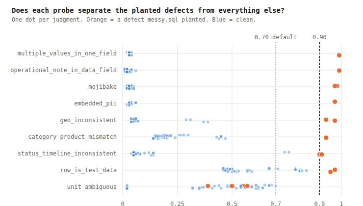
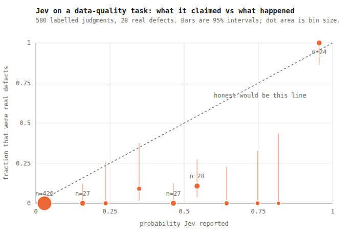

# Scoring Jev's judgments against known ground truth

A calibration read on `duckdb-semantic-profile` at `82f838a`, using the fixtures
already in that repo. No API calls were made and no key was used.

`demo/messy.sql` enumerates every planted defect in its header comment.
`test/fixtures/shipments_cache.jsonl` holds 2,519 real Jev responses against
that same table. Put them together and you have a labelled
`(forecast, outcome)` corpus for a real task, which as far as I can tell nobody
has scored as one.

620 judgments carry a defensible label. 580 of those are in a tier where the
negative class is trustworthy, with 28 real defects among them.

## Two changes, both one-liners

**Raise the default threshold from 0.7 to 0.9.** On this fixture 0.9 strictly
dominates: identical recall, and every false positive disappears.

| threshold | flagged | caught | precision | recall |
| --- | --- | --- | --- | --- |
| 0.50 | 78 | 27/28 | 0.35 | 0.96 |
| 0.70 | 37 | 24/28 | 0.65 | 0.86 |
| **0.90** | **24** | **24/28** | **1.00** | **0.86** |

**Fix `unit_ambiguous`.** Every single miss in the corpus — all four of them —
is that one probe. Nothing else in the catalog misses anything.

## Why: the model separates almost perfectly, per probe



Eight of nine probes put every planted defect above 0.9 and everything clean
below it. `mojibake` is the extreme case: defects at 0.97–0.98, highest false
alarm 0.05. That is a gap of 0.92, on real data, with no tuning.

The two rows to look at:

**`unit_ambiguous` is inverted**, and it is a catalog bug rather than a model
failure. Its `applies_to` includes `count_or_quantity`, so it fires on `qty` —
a bare integer count — across essentially every row, at 0.62–0.70. Meanwhile
the genuine defects (`weight` holding a bare `26.4` next to `12 kg`) land at
0.39–0.57. The model is answering the question as written: a dimensionless
count *does* have an unrecoverable unit, in the sense the instructions ask
about. Either drop `count_or_quantity` from `applies_to`, or add a `false`
criterion along the lines of "a dimensionless count needs no unit."

**`row_is_test_data` conflates anomalous with fabricated.** The real test rows
(3, 17) score 0.95–0.97. But rows 5, 12 and 6 — production rows carrying a
*different* planted defect — score 0.81–0.84. The model is reporting "this row
smells wrong," which is true and is not what the probe asked. This is the
worst-calibrated probe in the set by a factor of 300 (reliability 0.329 against
0.0004 for `operational_note_in_data_field`). Tightening the `true` criterion to
insist on fabrication specifically, rather than implausibility, should separate
them.

## The calibration picture



Jev is close to a binary oracle here with an unreliable hedge zone. Below 0.1:
426 judgments, zero defects. Above 0.9: 24 judgments, 24 defects. In between,
92 judgments and only 4 defects — so everything from 0.3 to 0.9 reads as far
more suspicious than it turns out to be.

Overall ECE is 0.114 on the trustworthy tier, and nearly all of it comes from
that middle band. Per probe, the spread is enormous:

| probe | n | ECE | reliability |
| --- | --- | --- | --- |
| operational_note_in_data_field | 120 | 0.020 | 0.0004 |
| mojibake | 100 | 0.027 | 0.0008 |
| multiple_values_in_one_field | 80 | 0.030 | 0.0009 |
| embedded_pii | 40 | 0.033 | 0.0011 |
| geo_inconsistent | 40 | 0.078 | 0.014 |
| status_timeline_inconsistent | 40 | 0.105 | 0.034 |
| category_product_mismatch | 40 | 0.223 | 0.060 |
| unit_ambiguous | 80 | 0.249 | 0.117 |
| row_is_test_data | 40 | 0.536 | 0.329 |

Which is the argument against one global `threshold` across all probes. These
are nine different forecasters with nine different reliability curves, and a
single cutoff treats them as one.

## Three smaller things

**Don't derive the threshold from a cost ratio yet.** The textbook move is
`threshold = cost_false_positive / (cost_false_positive + cost_false_negative)`,
which for a profiler's lopsided costs gives something near zero. It assumes a
calibrated stream, and on this one it is 7x worse than the best achievable
cutoff. Calibrate first, then derive.

**Platt scaling fixes most of the gap.** Fitting on half the corpus and scoring
on the other half took held-out ECE from 0.082 to 0.012 and the reliability term
from 0.029 to 0.003. Two parameters and ~290 labels.

**`sem_column_flags` compares `format_inconsistency / 4.0` against the same
`threshold` as the probabilities.** That value is a 5-level severity rubric
rescaled, not a probability. At the 0.7 default it happens to do the right thing
(flags levels 3–4 only). It misbehaves as soon as someone lowers the threshold
to catch more: at 0.3 it starts firing on "nearly uniform, stray whitespace."
One knob, two meanings, in one column.

## A bonus: Jev is near-deterministic

The fixture asks 300 identical questions twice. 66% of them come back
bit-identical, the mean absolute difference is 0.008, and the verdict flips
across 0.7 in 0.33% of cases.

Two consequences. The content-addressed cache is on solid ground — replaying it
is a faithful reproduction, not an approximation. And the miscalibration above
is systematic rather than sampling noise, which means a fitted correction will
hold rather than wash out.

## Limitations, stated plainly

28 positives is a small number. Per-probe reliability at n=40 is noisy, and the
0.9-dominates-0.7 result rests on 13 false positives disappearing — real on this
fixture, not yet established in general. The spread between the best and worst
probe is large enough (300x) that I do not think it is noise, but the individual
values are soft.

Labels come from my reading of the `messy.sql` header, so they inherit whatever
that comment omits. I excluded `sentinel_used_as_value` entirely for this
reason: `shipped_at` is `''` on rows 7/14/15 and `notes` is `'none'` throughout,
both arguably sentinels the comment does not count, which would score honest
answers as errors. `internally_contradictory` and `quantity_amount_mismatch` are
reported separately as tier B for the same reason — the former is explicitly a
catch-all, so a row with any other planted defect may legitimately trip it, and
its apparent 0.33 ECE is probably my labels being wrong rather than the model.

Scaling `messy.sql` to a few hundred rows with programmatically planted defects
would settle all of this, and would produce the first properly-powered
calibration measurement of Jev on any task.

## Reproducing

```sh
python3 extract.py ../path/to/duckdb-semantic-profile   # writes pairs.json
node --experimental-strip-types score.mts               # every number above
node --experimental-strip-types charts.mts              # both figures
```

Scoring uses `@rdm/jev-mock` in this repo — Brier, log loss, ECE, Murphy's
decomposition, Wilson intervals, Platt scaling, the cost arithmetic.
